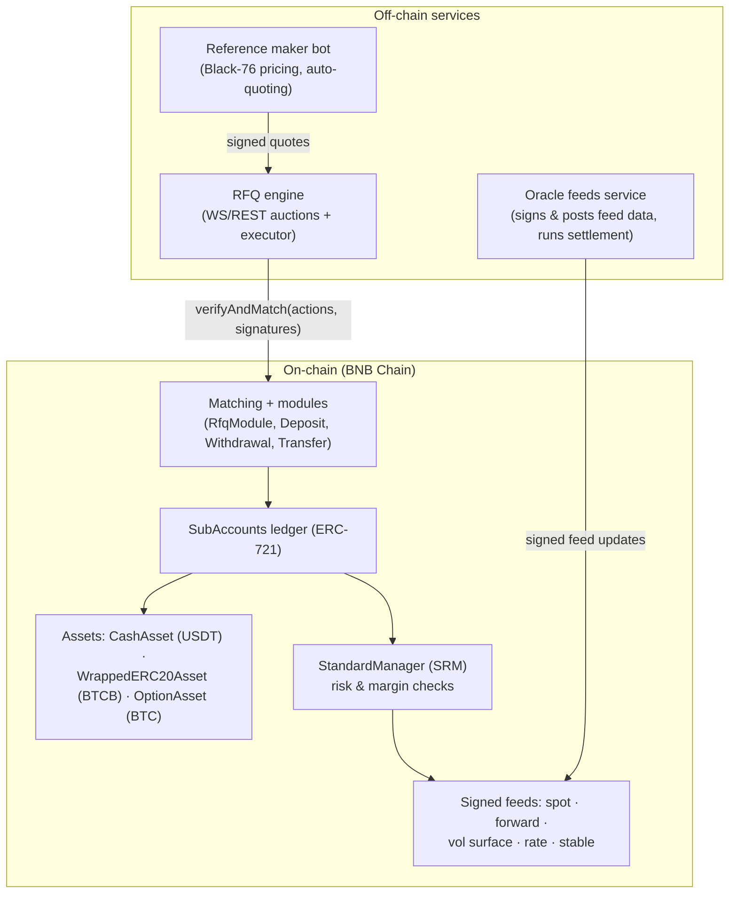

sats Options is built as three layers. The bottom layer — the contracts — is where all value lives and all rules are enforced. The layers above it only coordinate signatures and data; they can never move funds outside what a user has signed.

## On-chain layer

Everything that holds or moves value is a contract on BNB Chain:

<AccordionGroup>
  <Accordion title="SubAccounts — the ledger" icon="book">
    `SubAccounts` is an ERC-721 ledger. Each subaccount NFT holds signed asset balances (cash, BTCB collateral, option positions) and is risk-checked by its manager. All trades resolve to balance transfers inside this single ledger, which is what makes atomic multi-leg settlement possible.
  </Accordion>
  <Accordion title="Assets — cash, collateral, options" icon="coins">
    - **CashAsset (USDT)** — the protocol's cash leg: premiums, fees, and settlement all denominate here. A negative cash balance is a borrow against other collateral, subject to margin.
    - **WrappedERC20Asset (BTCB)** — physical BTCB collateral backing covered calls.
    - **OptionAsset (BTC)** — option positions, one balance per instrument (`subId` encodes expiry, strike, call/put).

    All protocol amounts use **18 decimals** (BTCB and BSC USDT are natively 18-decimal tokens).
  </Accordion>
  <Accordion title="StandardManager (SRM) — risk" icon="shield">
    The StandardManager runs initial-margin checks inside every trade transaction and charges the open-interest fee. v1 uses standard (non-portfolio) margin: light on gas and well-suited to shared blockspace. A covered call — short call fully backed by BTCB — passes by construction; a long call is fully paid-for and needs no maintenance margin.
  </Accordion>
  <Accordion title="Matching + modules — execution" icon="git-merge">
    `Matching` is the EIP-712 verifying contract and custodian of trading subaccounts. Every state change is a signed **Action** routed to a single-purpose module:
    - **RfqModule** — the v1 execution path: pairs a maker's signed quote with a taker's signed accept and submits all legs as one atomic batch.
    - **DepositModule / WithdrawalModule / TransferModule** — signed balance operations.
    - **TradeModule** — deployed but dormant; reserved for a future central-limit order book.

    Only registered *trade executors* can call `Matching.verifyAndMatch`, and modules enforce that an executor can never exceed what the signatures authorize.
  </Accordion>
  <Accordion title="Signed feeds — the protocol's marks" icon="radio">
    Margin and settlement read from on-chain **signed feeds**: BTC spot, per-expiry forwards, an SVI volatility surface, interest rates, and a USDT/USD stable feed. Feed updates are signed off-chain by whitelisted signers (N-of-M with heartbeats and confidence values) and posted on-chain, where anyone can read them. See [Oracles & feeds](/reference/oracles).
  </Accordion>
</AccordionGroup>

## Off-chain layer

Three small services coordinate the auction — none of them custody funds:

| Service | Role |
|---|---|
| **RFQ engine** | WebSocket/REST auction service. Broadcasts RFQs to authenticated makers, collects sealed signed quotes, picks the winner, and submits `Matching.verifyAndMatch` on-chain as the registered trade executor. |
| **Oracle feeds service** | Signs and posts feed data (spot/forward/vol/rate/stable) and runs settlement at expiry. |
| **Reference maker bot** | A complete reference market maker: authenticates, prices with Black-76 off the on-chain feeds, signs and submits quotes. Integrators adapt it or treat it as a living spec. |

The deliberate consequence of this split: **a malicious or dead coordinator is an availability problem, not a custody problem.** Signed quotes are bounded by their own price, size, and expiry; users always retain a permissionless path to withdraw their subaccount from Matching (see [Risk & operational notes](/market-makers/risk-ops#self-custody-and-the-escape-hatch)).

## Why RFQ instead of an order book?

An on-chain order book needs resting orders, cancels, and high-frequency updates — expensive and latency-sensitive on shared blockspace. An RFQ auction needs exactly two signatures per trade and one transaction. For an options market where retail flow is episodic and makers price per-request, sealed-bid first-price RFQ delivers competitive pricing with a fraction of the surface area. The architecture keeps the door open: the same account, asset, and margin rails support an order book later via the dormant TradeModule.

## Provenance

The settlement contracts are a **fork of audited, open-source protocol contracts** (GPL-3.0 core, AGPL-3.0 matching layer) whose base was audited by Sigma Prime. sats Options pins the forked snapshot, deploys it with its own scripts, and treats the vendored source as read-only; modifications to the AGPL matching layer are published as the license requires. Full licensing detail in [Why BNB Chain & licensing](/why-bnb#licensing-and-provenance).
