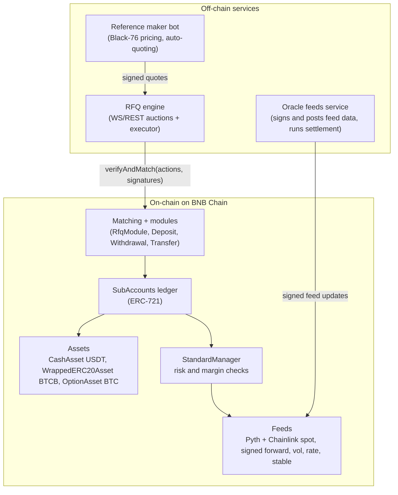

# Hedge Product and Architecture Brief

## The Vision

Hedge should make options feel like setting a simple BTC target.

Most people do not wake up wanting to trade derivatives. They either want to buy more bitcoin cheaper, or sell some bitcoin higher. Hedge can turn those two intents into a normal personal-finance action:

- **Buy BTC cheaper:** reserve USDT, choose a lower BTC price, and get paid today for agreeing to buy if BTC reaches that level. Under the hood, this is a cash-secured put.
- **Sell BTC higher:** commit BTCB, choose a higher BTC price, and get paid today for agreeing to give up upside above that level until expiry. Under the hood, this is a fully collateralized covered call.

The promise is not "free money" or "betting without losing." It is simpler and more honest: pick a price you already like, know the reward before you commit, and let market makers compete to pay you for that commitment.

For a beginner, Hedge should feel like:

- "I want to stack BTC, but I would rather buy lower."
- "I already hold BTC, and I would be happy selling higher."
- "What price do I want, how much am I committing, and what reward do I get for commiting today?"

For a more sophisticated user, Hedge should be transparent that this is options made simple. The product should not pretend the mechanics are magic. The simple UX is the abstraction; the financial primitive underneath is still an option.

The current detailed implementation below focuses on the sell-higher flow: a fully collateralized BTC covered call. The buy-cheaper flow is the natural symmetric product to build on the same RFQ, margin, oracle, and settlement rails.

## Boring Details

The rest is the implementation and architecture reference: useful, precise, and intentionally less shiny than the product framing.

### Product Summary

Hedge lets BTCB holders earn upfront USDT income by selling a clearly defined part of their future upside.

In plain language, the covered-call product is:

- "I already own BTC."
- "I would be happy selling above a certain price."
- "Pay me today for committing to that price until a fixed date."

The user keeps custody through an on-chain subaccount. The protocol does not rely on an off-chain ledger, private bilateral credit, or delayed manual settlement. The option leg, cash premium, and margin checks happen together in a single on-chain transaction.

The main retail framing is "sell BTC higher and get paid to wait." For users who understand options, the explicit financial primitive is a covered call.

### What A Covered Call Means

A covered call is a conservative options strategy:

1. The user owns BTC.
2. The user sells someone else the right to buy BTC exposure at a chosen price, called the strike.
3. The buyer pays the user a premium upfront.
4. At expiry, the trade has one of two outcomes.

If BTC settles below the strike:

- The option expires worthless.
- The user keeps the BTCB.
- The user also keeps the USDT premium.

If BTC settles above the strike:

- The option finishes in the money.
- Hedge cash-settles the difference in USDT.
- The user pays `(settlement price - strike) x size` in USDT.
- The BTCB remains in the user's subaccount.
- Economically, the user sold the upside above the strike, which is the price they chose upfront.

The trade-off is explicit: the user receives guaranteed income today, but gives up upside above the chosen strike until expiry.

### Why Hedge Is Different

Hedge is built around four core differences:

1. Fully on-chain settlement
  There is no off-chain ledger, novation flow, or hidden counterparty credit. The option and cash legs move atomically, with risk checks in the same transaction.
2. Competitive RFQ auctions
  Each trade is a short sealed-bid, first-price auction. Connected market makers submit signed quotes, and the highest premium wins.
3. Upfront premium
  The winning maker pays the premium immediately in USDT. The user does not wait until expiry.
4. Fully collateralized positions
  Short calls are backed 1:1 by BTCB in the user's subaccount. This avoids undercollateralized option writing and removes liquidation risk for the covered position.

### User Lifecycle

The covered-call flow has five steps.

#### 1. Deposit BTCB

The user creates a subaccount, which is an on-chain account represented by an ERC-721 ledger entry.

The user deposits BTCB into that subaccount. This BTCB is the collateral that makes the call "covered." It stays in the subaccount during the life of the trade.

#### 2. Pick A Strike And Expiry

The user chooses:

- A strike, meaning the BTC price they would be happy selling upside above.
- An expiry, meaning the date the option settles.

Hedge uses European-style BTC options with names like:

```text
BTC-20260619-69000-C
```

That means a BTC call option expiring on 2026-06-19 with a 69,000 USDT strike.

#### 3. RFQ Auction

The user's request-for-quote is broadcast to connected market makers.

For a short fixed window, makers submit sealed signed bids. Nobody sees anyone else's bid before the auction closes. The highest premium wins. If there is a tie, the earliest bid wins.

The user then accepts the winning quote with their own signature.

#### 4. Premium Paid Upfront

The protocol executes the maker signature and taker signature in one atomic transaction.

In that transaction:

- The option moves from the user to the maker.
- The maker's USDT premium moves to the user.
- Margin and risk checks run in the same transaction.

If any part fails, the full transaction fails.

#### 5. Settlement At Expiry

Options are European and cash-settled in USDT.

At expiry, a settlement price is fixed on-chain, and anyone can trigger settlement permissionlessly.

If BTC is below the strike, the option expires worthless.

If BTC is above the strike, the user's subaccount is debited:

```text
(settlement price - strike) x size
```

The maker's subaccount is credited the same amount. The user's BTCB remains in the subaccount.

### Worked Example

Here is the first live testnet trade as a concrete example:


| Item                   | Value                  |
| ---------------------- | ---------------------- |
| Spot BTC at trade time | 62,790 USDT            |
| User deposit           | 1 BTCB                 |
| Option sold            | `BTC-20260619-69000-C` |
| Strike                 | 69,000 USDT            |
| Strike distance        | About 110% of spot     |
| Time to expiry         | 8 days                 |
| Winning auction bid    | 378.59 USDT            |
| Premium timing         | Paid immediately       |


Outcome if BTC fixes at 65,000 USDT:

- The option expires worthless.
- The user keeps 1 BTCB.
- The user keeps 378.59 USDT.

Outcome if BTC fixes at 72,000 USDT:

- The option finishes in the money.
- The user pays 3,000 USDT cash settlement.
- The user still holds 1 BTCB.
- The user also keeps the 378.59 USDT premium.

### What Users Get And Give Up

Users get:

- USDT premium upfront.
- Competitive pricing from a sealed-bid maker auction.
- Self-custody through an on-chain subaccount.
- No liquidation risk on the fully covered position.

Users give up:

- Upside above the chosen strike until expiry.
- The ability to buy back or exit the position before expiry in v1.

The current testnet open-interest fee is:

- `0.1%` of notional.
- `10 USDT` floor per side.
- Governance-settable.
- Read live by the system.

### Trust Model

The user signature authorizes exactly one trade:

- This option.
- This premium.
- This subaccount.
- One execution only.
- Before a specific deadline.

The RFQ operator cannot alter the price or size, redirect funds, or execute the same authorization twice. The contracts enforce those constraints.

If the operator disappears, the user still has a permissionless escape hatch to withdraw from the subaccount path.

The important product implication is that off-chain services coordinate availability and quoting, but they do not custody user funds.

### System Architecture

Hedge has three major layers:

1. On-chain contracts
2. Off-chain RFQ and execution services
3. Oracle and market data services

The bottom layer, the contracts, holds all value and enforces all rules. The layers above coordinate signatures and data, but cannot move funds outside what users and makers have signed.




### On-Chain Layer

#### SubAccounts

`SubAccounts` is the core ledger.

Each subaccount is represented by an ERC-721 NFT and holds signed asset balances:

- Cash
- BTCB collateral
- Option positions

Trades resolve as balance transfers inside this ledger. That design enables atomic multi-leg settlement.

#### Assets

The protocol uses three main asset types:


| Asset               | Role                                                                     |
| ------------------- | ------------------------------------------------------------------------ |
| `CashAsset`         | USDT cash leg for premiums, fees, and settlement                         |
| `WrappedERC20Asset` | BTCB collateral backing covered calls                                    |
| `OptionAsset`       | BTC option positions, with `subId` encoding expiry, strike, and call/put |


All protocol amounts use 18 decimals. BTCB and BSC USDT are both 18-decimal tokens.

#### StandardManager

`StandardManager` runs risk and margin checks inside every trade transaction.

v1 uses standard margin, not portfolio margin. This is lighter on gas and fits shared BNB Chain blockspace.

Covered calls pass by construction because the short call is fully backed by BTCB. A long call is fully paid for and does not need maintenance margin.

#### Matching And Modules

`Matching` is the EIP-712 verifying contract and custodian of trading subaccounts.

Every state change is a signed action routed to a module:


| Module             | Role                                                                                                      |
| ------------------ | --------------------------------------------------------------------------------------------------------- |
| `RfqModule`        | v1 execution path. Pairs maker signed quote with taker signed acceptance and submits all legs atomically. |
| `DepositModule`    | Signed deposit operations.                                                                                |
| `WithdrawalModule` | Signed withdrawal operations.                                                                             |
| `TransferModule`   | Signed balance transfers.                                                                                 |
| `TradeModule`      | Deployed but dormant. Reserved for a future central-limit order book.                                     |


Only registered trade executors can call `Matching.verifyAndMatch`.

Modules enforce that an executor cannot exceed what the signatures authorize.

#### Oracles And Feeds

BTC spot uses:

- Pyth as the primary BTC/USD source.
- Chainlink as a circuit breaker.

If Chainlink deviates by more than 1% from Pyth, the adapter zeroes the price confidence, which trips the margin system's oracle-contingency penalty.

Other feed data is posted as on-chain signed feeds:

- Per-expiry forwards
- SVI volatility surface
- Interest rates
- USDT/USD stable feed

Updates are signed off-chain by whitelisted signers with heartbeats and confidence values, then posted on-chain.

Settlement is priced off the signed forward print.

### Off-Chain Layer

The off-chain layer coordinates auctions and data. It does not custody funds.


| Service              | Role                                                                                                                                                                        |
| -------------------- | --------------------------------------------------------------------------------------------------------------------------------------------------------------------------- |
| RFQ engine           | WebSocket/REST auction service. Broadcasts RFQs, collects sealed signed quotes, chooses the winner, and submits `Matching.verifyAndMatch` as the registered trade executor. |
| Oracle feeds service | Signs and posts forward, vol, rate, and stable feed data; relays Pyth spot updates on demand; runs settlement at expiry.                                                    |
| Reference maker bot  | Complete example market maker. Authenticates, prices with Black-76 using protocol feeds, signs quotes, and submits them.                                                    |


The deliberate consequence is that a malicious or dead coordinator is an availability problem, not a custody problem.

Signed quotes are bounded by price, size, expiry, subaccount, and deadlines. Users keep a permissionless path to withdraw.

### Why RFQ Instead Of An Order Book

An on-chain order book requires:

- Resting orders
- Cancels
- High-frequency updates
- More gas
- More latency sensitivity

The v1 RFQ model requires:

- One maker signature
- One taker signature
- One on-chain transaction

For retail options flow, where users trade occasionally and makers price each request, a sealed-bid first-price RFQ is simpler and still competitive.

The architecture leaves room for an order book later because the same account, asset, and margin rails can support the dormant `TradeModule`.

### Why BNB Chain

Hedge deploys directly on BNB Chain L1, not on an app-chain or L2.

The chain thesis has four main reasons.

#### Fast And Cheap Blockspace

Post-Fermi, BSC is described as running around:

- `0.45s` blocks
- `1.1s` finality
- About `0.05 gwei` gas

The RFQ model is lightweight enough for this shared blockspace because each trade is only two signatures and one transaction.

#### BTCB And Stablecoin Liquidity

BTCB and deep stablecoin liquidity, especially USDT liquidity, are native to BSC.

That matters because the protocol needs:

- BTCB collateral
- USDT premiums and settlement
- Market maker hedging infrastructure
- Oracle infrastructure

Avoiding bridge friction is useful for both users and makers.

#### Gasless UX Path

BNB Chain's MegaFuel paymaster can sponsor plain EOA transactions without forcing users to migrate to account abstraction.

EIP-7702, live since the Pascal upgrade, enables batched approve-and-trade flows.

The product implication is that deposits, trades, and settlement can eventually be sponsored or batched without rebuilding the wallet model.

#### Options White Space

BNB Chain has meaningful spot and perpetuals activity, but does not yet have a major live options venue.

For Hedge, that makes the chain choice a distribution decision, not only an infrastructure decision: retail BTCB already lives on BSC, and the product can meet that liquidity directly.

### Why Not An App-Chain Or L2

Some options protocols run their own chain because portfolio-margin risk checks can be extremely expensive and require a private sequencer.

Hedge v1 does not need that path because:

- It uses standard margin.
- It uses RFQ execution.
- It does not run a high-frequency cross-margined order book.

An app-chain would add:

- Sequencer operations
- Bridge liquidity bootstrapping
- More maker onboarding friction
- Less native BNB distribution

The chain question should be revisited only if Hedge evolves into sub-100ms cross-margined order-book territory.

Settlement-critical transactions are submitted by the protocol executor. Private transaction relays are used to keep executor flow out of the public mempool.

### Licensing And Provenance

The on-chain contracts are a fork of audited open-source options-protocol contracts.


| Layer          | License          | Notes                                                                                                                                                                             |
| -------------- | ---------------- | --------------------------------------------------------------------------------------------------------------------------------------------------------------------------------- |
| Core protocol  | GPL-3.0-or-later | Ledger, assets, risk manager, and feeds. Forked from a pinned snapshot whose BUSL-1.1 change date has passed, converting it to GPL-3.0. Later upstream BUSL commits are not used. |
| Matching layer | AGPL-3.0         | Matching, ActionVerifier, RfqModule, and deposit/withdraw/transfer modules. Modifications are published as required.                                                              |
| Math utilities | AGPL-3.0         | Forked utility libraries.                                                                                                                                                         |


The base contracts were audited by Sigma Prime.

Hedge pins the audited snapshot, keeps vendored source read-only, and limits its own surface mostly to:

- Deployment scripts
- Configuration
- Off-chain services
- Product UI
- Operational tooling

Changes relative to the audited base are the natural target for differential audits.

The trademark boundary is explicit:

- GPL and AGPL grant code rights.
- They do not grant trademark rights.
- Hedge is an independent deployment with its own name, domain separator, addresses, and operations.
- Hedge has no affiliation with or endorsement from the upstream protocol authors.

Components without clear licensing upstream were not forked. The RFQ engine, feed poster, and maker bot are described as original implementations.

The repository should keep `protocol/PROVENANCE.md` as the source of truth for pinned commits and per-file license review.