# RFQ market maker

Status: **shadow-only research and decision kernel; not production-ready and incapable of placing an order.**

Last reviewed: 2026-08-14.

This is an isolated successor candidate to `services/maker-bot`. The existing maker is intentionally unchanged. This package models whether to quote a narrow RFQ product, how to reserve risk for a possible fill, and what a delta hedge on Hyperliquid would look like. It contains no Derive client, Hyperliquid SDK, wallet, signer, credential loader, socket, HTTP request, database, or live-order path.

All monetary, quantity, rate, and timestamp values in the current kernel are JavaScript `number` values for analytics. They must not cross a live signing, settlement, accounting, or venue boundary. A production adapter must convert validated decimal strings to exact fixed-point integers and reject values that cannot be represented exactly.

> **Limit warning:** every value in `DEFAULT_SHADOW_POLICY`, every amount in `shadow-demo.ts`, and every numeric example in these documents is illustrative test data. None is an approved live risk limit, trading mandate, fee assumption, or rollout threshold.

## What exists now

- Black-76 call/put premium, forward delta, forward gamma, vega, and calendar theta.
- A pure `evaluateQuote(input)` function returning either `QUOTE` or `DECLINE`, with stable reason codes and gate diagnostics.
- Fail-closed shadow admission for invalid policy/portfolio state, stale hedge reconciliation, a pending hedge backlog, excessive existing residual delta, and mismatched Hyperliquid network/account/coin.
- A conservative long-option bid ceiling that subtracts protocol, hedge, rehedging, funding, basis/latency, adverse-selection, model, capital, concentration, and required-profit charges.
- Portfolio checks over confirmed risk plus all live quote reservations, with a configurable spot/IV scenario grid used to reserve stressed delta, gamma, vega, hedge notional, and hedge margin.
- Runtime shadow validation for finite/non-negative portfolio measures, reservation identities/versions, two-sided non-crossed hedge books, rate/volatility/basis bounds, and snapshot identities.
- A shadow-only, in-memory compare-and-swap reservation ledger.
- Directional order-book walking to prove that the initial hedge fits inside a configured adverse-slippage boundary.
- A pure Hyperliquid hedge planner that returns `NOOP`, `BLOCKED`, or IOC order intents with deterministic client order IDs. It never submits them.
- A deterministic demo using only local fixtures.

## What does not exist

- Derive authentication, RFQ ingestion, quote signing, quote submission, cancellation, or fill confirmation.
- Hyperliquid networking, signing, order submission, cancel, fill consumption, or account reconciliation.
- A trusted instrument registry/decoder.
- A market-data/account adapter, volatility surface, fee oracle, hedge reconciliation service, or source failover policy implementation.
- Durable reservations, positions, fills, orders, P&L, audit records, leader election, or restart recovery.
- Exact fixed-point wire arithmetic.
- A calibrated fill-probability model, competitive quote optimizer, or approved production configuration.
- An on-call deployment, secrets boundary, monitoring stack, or live kill switch.

Until all live-readiness gates in [Operations and rollout](docs/OPERATIONS_AND_ROLLOUT.md) are independently approved, `mode` remains structurally restricted to `SHADOW`.

## Economic thesis

The v0 mandate considers one direction only: a taker sells an approved BTC call and the maker buys it. The maker pays a bid below its conservative estimate of option value after every modeled cost and a required-profit reserve. A filled long call normally adds positive delta, so its first Hyperliquid hedge is normally a **short** BTC perpetual position—not a long one.

The intended gross economic result is:

```text
option liquidation or settlement proceeds
- option premium paid
- protocol and open-interest fees
- initial and subsequent hedge fees/slippage
- adverse funding
- basis, settlement, latency, model, and adverse-selection losses
- capital cost
= trading result
```

Delta hedging removes only a local, first-order price exposure. The maker still owns gamma and vega and remains exposed to theta, jumps, volatility-surface errors, Derive/Hyperliquid basis, funding, liquidity, margin, liquidation, settlement, operational, and counterparty/protocol risks. Profit is therefore not “the spread for free”; it is compensation for inventory, execution, capital, and model risk.

## Decision path

```mermaid
flowchart LR
  A["Canonical RFQ candidate"] --> B["Product and timing gates"]
  B --> C["Fresh option and hedge snapshots"]
  C --> D["Black-76 value and Greeks"]
  D --> E["Bounded initial hedge simulation"]
  E --> F["Independent collateral check"]
  F --> G["Conservative fair value minus all costs"]
  G --> H["Portfolio plus live-reservation limits"]
  H --> I{"Decision"}
  I -->|"any gate fails"| J["DECLINE with reason codes"]
  I -->|"all gates pass"| K["QUOTE plus reservation proposal"]
  K --> L["Coordinator must CAS-commit reservation"]
  L -. "not implemented" .-> M["Only then could a live adapter sign/send"]
```



The kernel does not mutate the ledger. A coordinator must read a reservation snapshot, evaluate against that version, and atomically commit the returned reservation. If compare-and-swap fails, it must discard the decision and recompute against a fresh snapshot.

## Running the local fixture

From the repository root:

```bash
pnpm --filter @hedge/rfq-market-maker typecheck
pnpm --filter @hedge/rfq-market-maker test
pnpm --filter @hedge/rfq-market-maker dev
```

The demo prints `sideEffectsPossible: false`. It also constructs a hypothetical hedge plan as if an attributable fill had later been confirmed. That is a local illustration, not fill inference and not an order submission.

## Documentation map

- [Architecture](docs/ARCHITECTURE.md): current kernel, target boundaries, and dependency rules.
- [Domain and units](docs/DOMAIN_AND_UNITS.md): signs, units, timestamps, and exact-arithmetic boundary.
- [Quote decision and economics](docs/QUOTE_DECISION_AND_ECONOMICS.md): gates, bid construction, and P&L thesis.
- [Risk model](docs/RISK_MODEL.md): exposures, reservations, limits, and model gaps.
- [Hyperliquid hedging](docs/HYPERLIQUID_HEDGING.md): target-position logic, IOC plans, reconciliation, and venue risks.
- [State and recovery](docs/STATE_AND_RECOVERY.md): current in-memory CAS semantics and required durable state machine.
- [Market data and models](docs/MARKET_DATA_AND_MODELS.md): snapshot contract, Black-76 assumptions, and validation.
- [Security and trust](docs/SECURITY_AND_TRUST.md): trust boundaries, signing isolation, attribution, and abuse controls.
- [Configuration](docs/CONFIGURATION.md): every policy field and its current shadow default.
- [Operations and rollout](docs/OPERATIONS_AND_ROLLOUT.md): observability, incidents, staged rollout, and hard live gates.
- [References](docs/REFERENCES.md): primary protocol, venue, SDK, and model sources.
- [Architecture decision records](docs/decisions/README.md): accepted decisions, rejected alternatives, and revisit triggers.

## Non-negotiable live invariants

1. No quote may be signed or sent unless its worst-case exposure is durably reserved first.
2. Every live quote reservation remains counted until authoritative cancellation/expiry plus finality, or is atomically converted into a confirmed position after an attributable fill.
3. A hedge may be generated only from confirmed, maker-attributable option fills—not from RFQ receipt, quote acknowledgement, auction result, or a non-authoritative broadcast.
4. Hedge target is portfolio based: `target signed perp position = -confirmed option delta`, adjusted only by an explicitly approved cross-venue beta.
5. Outstanding hedge orders must be reconciled before another plan can increase or reverse exposure.
6. Stale, future-dated, low-confidence, unhealthy, internally inconsistent, or unexecutable market data causes a decline or hedge block.
7. Derive collateral and Hyperliquid collateral are independent. Unsettled option value is not available to prevent Hyperliquid liquidation.
8. No analytics `number` is serialized into a signature or venue request.
9. Startup and reconnect remain fail-closed until RFQs, reservations, fills, positions, open orders, balances, and nonces reconcile.
10. Operators can halt quoting independently from emergency hedge reduction; automated actions remain bounded, authenticated, idempotent, and auditable.
