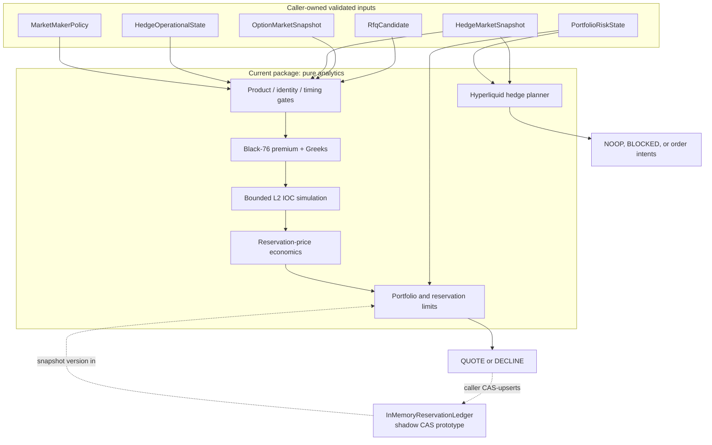
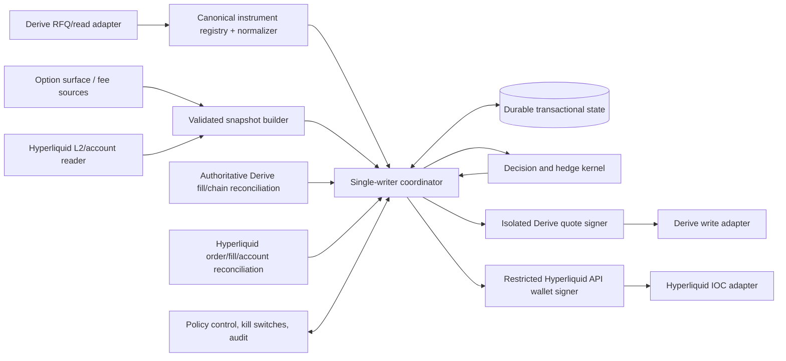

# Architecture

Last reviewed: 2026-08-14. Current status: shadow-only.

## Objective and boundary

The service is a separate package so production controls can be developed without changing or accidentally activating `services/maker-bot`. Its present boundary is a deterministic analytics kernel. It accepts already-normalized domain data and returns decisions or plans; it owns no network connection, key, balance, or venue state.

The narrow v0 product is a single approved BTC call where `TAKER_SELLS_OPTION`: the maker receives a long option position and pays premium. Puts, multi-leg RFQs, taker-buy direction, unapproved assets, non-BTC underlyings, and unsupported settlement currencies are declined.

## Current component map

Current modules:

| Path | Responsibility | Side effects |
| --- | --- | --- |
| `src/domain/types.ts` | Explicit domain input contracts and units | None |
| `src/config.ts` | Shadow policy schema, example defaults, and runtime policy invariants | None |
| `src/pricing/black76.ts` | Premium and analytical Greeks | None; rejects invalid inputs |
| `src/market/order-book.ts` | Directional book walk, slippage boundary, venue tick rounding | None |
| `src/risk/exposures.ts` | Exposure validation/aggregation, limit breaches, utilization | None |
| `src/decision/quote-engine.ts` | Fail-closed quote/decline gates and economics | None |
| `src/risk/reservations.ts` | Versioned, process-local reservation prototype | In-memory mutation only |
| `src/hedging/hyperliquid-plan.ts` | Portfolio target and bounded IOC order intents | None |
| `src/shadow-demo.ts` | Fixed local example | Standard output only |

`evaluateQuote` and `planHyperliquidHedge` do not access clocks themselves. Callers supply `nowMs`, snapshot timestamps, policy/model versions, portfolio and hedge-reconciliation state, and correlation identity, making replay deterministic given identical inputs.

Before product gates, quote admission validates the effective shadow policy, portfolio slices/reservations, ledger version, and `HedgeOperationalState`. New quotes stop when reconciliation is unhealthy/stale, any hedge order remains pending, or the confirmed option-plus-perp residual exceeds the quote-admission band. These are caller-supplied shadow facts; a production reconciliation service and durable portfolio revision remain missing.

## Required production topology

The following topology is a target, not implemented code:

### Boundary rules

- Ingress adapters parse external strings but cannot mark an instrument verified. Only a locally governed registry/decoder can construct `identityVerified: true` after address, sub-ID, expiry, strike, kind, multiplier, underlying, and settlement all agree.
- The coordinator owns lifecycle transitions. The decision kernel never publishes, signs, persists, or assumes a fill.
- Signers receive an exact, policy-approved intent, reconstruct the complete payload, enforce independent limits, and return a signature. They never accept arbitrary bytes to sign.
- Read and write credentials are distinct. A market-data compromise cannot place an order; a quote-signing credential cannot move unrelated assets.
- Durable state is the source of truth for intent and attribution. Venue queries are reconciled evidence, not substitutes for internal idempotency.
- The Hyperliquid adapter must submit only intents emitted by the planner, then reconcile the exchange response, order updates, fills, and clearinghouse state.
- Observability is append-only and redacted. Logs are not authoritative position state.

## Failure domains

| Failure | Safe behavior |
| --- | --- |
| Derive RFQ feed stale/disconnected | Stop new quote decisions; retain reservations until reconciled |
| Option market data stale/unhealthy | Decline all affected RFQs |
| Hyperliquid L2/account stale/unhealthy | Decline new RFQs and block ordinary hedge submissions; page operator for confirmed unhedged delta |
| Reservation CAS conflict | Send nothing; reload and recompute |
| Derive quote response unknown | Treat quote as potentially live; reconcile by idempotency key/quote identity before retry |
| Fill broadcast ambiguous | Do not change position or hedge; query authoritative maker/quote/subaccount/chain evidence |
| Hyperliquid submit response unknown | Do not blindly resubmit; query by client order ID and account/open-order/fill state |
| Process restart | Start halted; rebuild state and reconcile both venues before any output action |
| Database unavailable | Stop quoting; do not use process memory as a production fallback |
| Clock uncertainty outside policy | Decline/block and alert |

## Dependency direction

Domain and math code must remain independent of transport SDKs. Adapters may depend on the kernel; the kernel must not depend on adapters. Exact wire types and private-key libraries belong outside `src/domain`, `src/pricing`, `src/risk`, and `src/decision`.

This preserves three reviewable surfaces:

1. Economic policy and deterministic mathematics.
2. Lifecycle, durability, idempotency, and reconciliation.
3. Protocol encoding, signing, networking, and credential custody.

No surface is sufficient alone for live trading.

## Availability versus safety

This system chooses missed trades over unknown exposure. All confidence, timing, identity, depth, collateral, and state checks are fail-closed. Redundant data sources may improve availability only after a documented arbitration policy; a silent fallback that removes confidence or freshness metadata is prohibited.

See the individual [decision records](decisions/README.md) for alternatives and revisit conditions.
