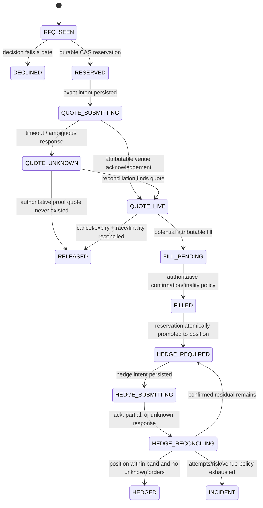

# State, lifecycle, and recovery

Last reviewed: 2026-08-14. Everything below the “required durable model” heading is a production design, not implemented behavior.

## Current in-memory prototype

`InMemoryReservationLedger` exists to demonstrate a transaction boundary:

- version starts at zero;
- `snapshot(nowMs)` validates that time is finite but returns **all** reservations, including entries past `expiresAtMs`;
- time never releases risk by itself; `expiresAtMs` only makes an entry eligible for authoritative terminal-state reconciliation and explicit release;
- `tryApply(expectedVersion, operation)` succeeds only when the expected version equals the current version;
- an upsert also requires its `basedOnLedgerVersion` to equal the expected version;
- successful upsert/release increments version;
- release of an unknown ID fails and leaves version unchanged;
- state is lost on process exit and is neither multi-process-safe nor durable.

The correct shadow interaction is:

```text
snapshot = ledger.snapshot(now)
decision = evaluateQuote(... snapshot.reservations, snapshot.version ...)
if decision is QUOTE:
    success = ledger.tryApply(snapshot.version, UPSERT(decision.reservation))
    if not success: discard and recompute from a new snapshot
```

Even after a successful in-memory upsert, current code must not sign/send a quote. The ledger cannot protect exposure across crashes, replicas, deployments, or venue ambiguity.

The current quote input also includes a caller-built `HedgeOperationalState`. Admission requires its reconciliation flag to be healthy, timestamp fresh, revision/count/residual finite and well formed, pending-order count zero, and residual portfolio delta inside policy. This is a valuable fail-closed interface but not durable evidence: there is no implemented reconciler or transaction linking that revision to the supplied option portfolio and Hyperliquid account.

## Required durable model

Use a transactional database with one logical writer per maker portfolio, optimistic revision checks, an outbox, and immutable event/audit records. A relational state model may include:

| Entity | Required identity and content |
| --- | --- |
| RFQ observation | venue RFQ ID, raw payload hash, normalized candidate, receive/source times, registry version |
| Decision | quote-attempt ID, input hashes, policy/model/build versions, gates, economics, decline reasons |
| Reservation | stable RFQ/quote key, exact exposure, lifecycle, expiry/finality, portfolio revision |
| Quote intent | exact signed fields before signature, max fee, expiry, nonce allocation, idempotency key |
| Quote observation | venue quote ID/status, request/response hash, timestamps, ambiguity state |
| Option fill | chain/transaction/log identity, maker/subaccount/quote/RFQ attribution, exact legs, fees, finality |
| Position lot | instrument, exact quantity/cash flow, source fill, current lifecycle, Greek snapshot references |
| Hedge intent | portfolio revision, target/effective/residual, snapshot ID, order plans, bounded attempts |
| Hedge order/fill | client ID, venue order ID, exact request/status/fills/fees, reconciliation cursor |
| Account snapshot | position, open orders, equity, margin, funding, venue timestamp, ingestion cursor |
| Policy action | version, author/approver, diff, effective time, rollback, reason |
| Operational action | halt/resume/manual correction, actor, evidence, approvals |

Raw external events are append-only. Corrections are new events with explicit provenance; rows are not silently rewritten to make reconciliation balance.

## Lifecycle



`DECLINED`, `RELEASED`, `FILLED`, and `HEDGED` are audit outcomes, not excuses to discard history.

### Transactional invariants

1. Reservation and quote-outbox intent are committed before any quote signature or network send.
2. Portfolio revision advances with every reservation, fill promotion, correction, or relevant risk-state mutation.
3. The signed payload is derived from the persisted exact intent and is hash-bound to it.
4. A fill is deduplicated by authoritative chain/venue identity and can promote a reservation at most once.
5. Fill promotion atomically releases/reduces reservation and adds exact confirmed position/cash flow.
6. Hedge intent is based on a specific confirmed portfolio revision and reconciled hedge state.
7. Hyperliquid client IDs are scoped by network/account/coin and unique for that intent/revision/sequence, then persisted before send.
8. Unknown quote or hedge outcomes remain exposure-bearing until disproven authoritatively.
9. Reservation expiry never deletes an actual fill; expiry cleanup and fill ingestion serialize or re-check authority.
10. Only a reconciled, leader-held coordinator may produce new outbox actions.

## Fill authority and attribution

The production integration must establish a documented evidence hierarchy from the deployed Derive contracts and API. An on-chain successful receipt plus the expected RFQ completion event from the approved contract is the strongest intended evidence; API quote/transaction status and socket messages are supporting observations. The exact event name, fields, chain ID, contract address, confirmations/finality rule, and reorganization behavior must be verified against the deployed ABI before implementation.

Attribution must match at least:

- chain/network and approved RFQ contract;
- maker wallet and maker subaccount;
- RFQ and quote identity, or a cryptographic mapping to the signed legs hash;
- exact option asset, sub-ID, amount sign, amount, price, fee bound, signer, nonce, and expiry;
- transaction hash and unique log index/event identity;
- successful receipt and configured finality status.

A global “RFQ executed” notification without maker attribution is never enough to change this portfolio.

## Startup and reconnect

Every start is fail-closed:

1. Acquire portfolio leadership/lease; quoting remains halted.
2. Load latest durable policy, registry, portfolio revision, reservations, quote intents, fills, hedge intents, nonces, and reconciliation cursors.
3. Verify database migrations and immutable-audit integrity.
4. Query Derive for open/recent quotes and transactions; backfill chain logs across a safe overlap window.
5. Query Hyperliquid clearinghouse position, equity/margin, open orders, order status by client IDs, fills, funding, and ledger updates.
6. Deduplicate and apply missing authoritative events transactionally.
7. Classify every unknown action. Keep uncertain reservations/pending quantities counted.
8. Recompute exact positions, cash, Greeks, risk, hedge target, and daily P&L from authoritative records.
9. Compare independent calculations and external venue state. Any unexplained difference remains an incident.
10. Start fresh market streams, prove snapshot freshness/continuity, then obtain an explicit automated/manual resume authorization.

WebSocket reconnects require snapshot semantics and REST/info backfill. A reconnect is not proof that nothing happened during disconnection.

## Unknown outcomes

Network timeouts occur after a venue may have accepted an action. Therefore:

- never reuse a new idempotency identity just because the first request timed out;
- persist the ambiguous state;
- query the venue/chain using the original identity;
- compare exact payload hashes and account consequences;
- retry only after proving non-acceptance or by sending a newly computed residual hedge;
- page when ambiguity exceeds the bounded reconciliation deadline.

For quotes, the reservation remains live. For hedges, pending signed quantity remains included until order/fill/cancel state is known.

## Recovery objectives and backups

Recovery time and recovery point objectives require risk-owner approval; no numeric objective is approved in this document. The design requires:

- synchronous durable writes before side effects;
- encrypted, tested backups and point-in-time recovery;
- restoration drills that replay external events without duplicate actions;
- schema/adapter backward compatibility during rolling deploys;
- disaster-recovery credentials separated from application credentials;
- a reconciliation report proving positions, reservations, open orders, balances, and nonces before resume.

If durable state cannot be trusted, the safe state is halt, inventory reconciliation, and controlled risk reduction—not reconstruction from logs alone and not automatic fresh quoting.
